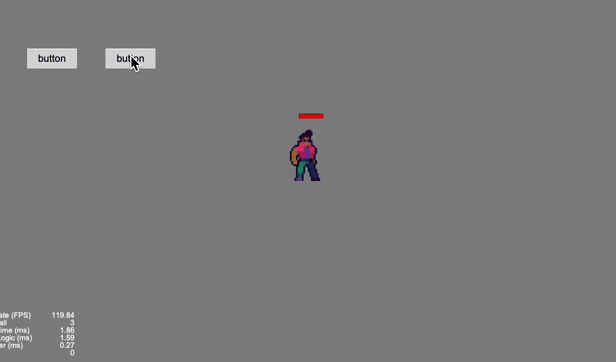
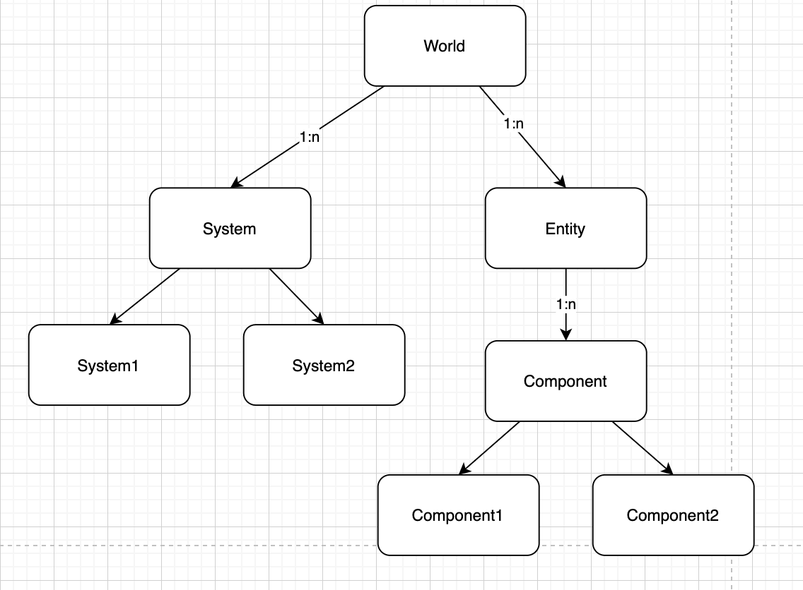
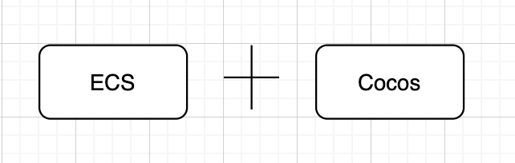
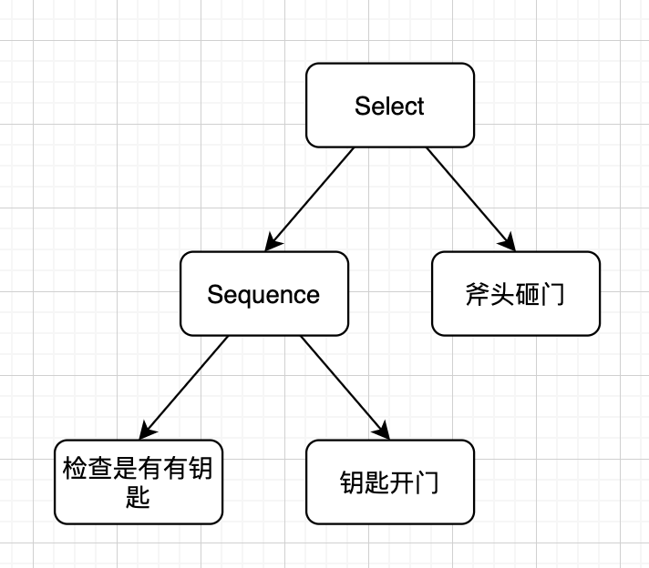
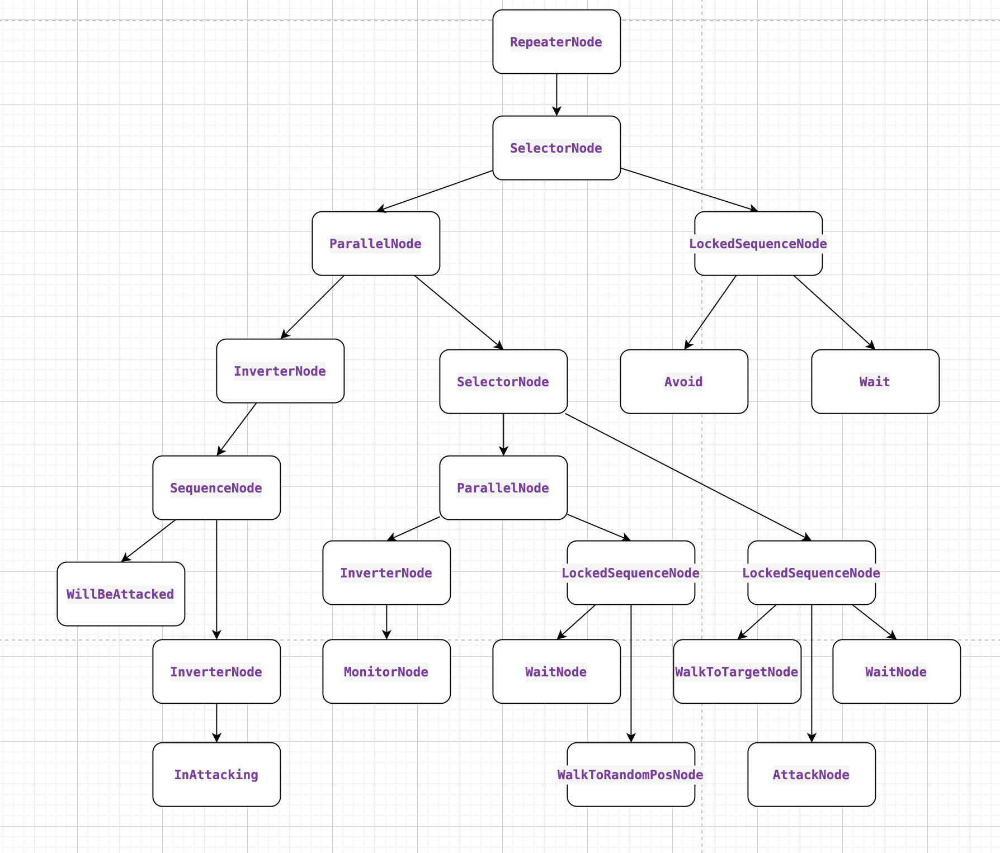

# 在Cocos中使用ECS + BehaviorTree 实现格斗AI
### 成品展示

demo 角色AI包含了巡逻, 追踪, 攻击, 躲避攻击, 受伤打断攻击, 攻击打断闪避等. 可以细心看一下二图.

巡逻中


追逐打斗




完整展示视频链接: 

https://www.bilibili.com/video/bv1hi4y1Q7Uv


代码链接在文章末位.


### 1. 写一个ECS框架

**ECS** 全称 Entity - Component - System(实体 - 组件 - 系统).  

**组件只有属性没有行为, 系统只有行为没有属性.**

-------

本来这里想介绍一下ECS的概念,  但是写起来感觉像是记流水账, 网上已经有很多ECS的介绍文章了, 所以觉得不如贴几篇我个人觉得写的好的, 谈一谈我的理解. 

[浅谈《守望先锋》中的 ECS 构架](https://blog.codingnow.com/2017/06/overwatch_ecs.html)

这篇文章应该是最早一批介绍ECS架构的文章了, 看过好几遍, 不仅全面的介绍了ECS架构, 还对比了ECS和传统游戏开发架构的区别. 以及在网络同步时的处理.

[游戏开发中的ECS 架构概述](https://zhuanlan.zhihu.com/p/30538626)

这篇文章比较接地气

> ***ECS***，即 Entity-Component-System（实体-组件-系统） 的缩写，其模式遵循[组合优于继承](https://link.zhihu.com/?target=https%3A//en.wikipedia.org/wiki/Composition_over_inheritance)原则，游戏内的每一个基本单元都是一个**实体**，每个**实体**又由一个或多个**组件**构成，每个**组件**仅仅包含代表其特性的数据（即在组件中没有任何方法），例如：移动相关的组件`MoveComponent`包含速度、位置、朝向等属性，一旦一个实体拥有了`MoveComponent`组件便可以认为它拥有了移动的能力，**系统**便是来处理拥有一个或多个相同**组件**的**实体**集合的工具，其只拥有行为（即在系统中没有任何数据），在这个例子中，处理移动的**系统**仅仅关心拥有移动能力的**实体**，它会遍历所有拥有`MoveComponent`**组件**的**实体**，并根据相关的数据（速度、位置、朝向等），更新实体的位置。
> 
> **实体**与**组件**是一个一对多的关系，**实体**拥有怎样的能力，完全是取决于其拥有哪些**组件**，通过动态添加或删除**组件**，可以在（游戏）运行时改变**实体**的行为。


**这段话对于ECS的关系也是我设计的框架遵守的规则.** 即Component只包含属性, System只包含行为.


#### 1. 这个ECS框架做了什么

World-Entity-Component-System的关系图



**World每帧根据顺序调用所有的System, System中会处理对应的Component. 在这个过程中, 使用者可以动态的创建或销毁Entity, 给Entity添加或移除Component.**


为了更高效的维护Entity-Component-System的关系, 我采取了一些办法.

###### 1. 所有的Component都通过其对应的ComponentPool维护.

例如MoveComponent会生成一个MoveComponentPool进行维护, 方便实现复用. 外面不直接持有Component, 而是通过component在pool中的index索引便可以在对应的pool中获取到对应的Component.

###### 2. Entity使用自增Id标识.

外部不需要持有Entity对象, 或者说没有Entity对象, 所有的Entity都是一个Id, 通过这个Id在world内进行操作.

###### 3. System通过Filter类管理关注的Entity.

上文中提到System为了处理其关心的ComponentA, 会遍历所有拥有该ComponentA的Entity. 但是怎么判断哪下Entity有这个ComponentA呢?  传统的方法会遍历所有的Entity, 判断其是否有ComponentA, 这种方案明显是不够高效的. 所以这里引入了Filter类, 其方法的核心是空间换时间并有一套判断规则(接收某些类型的组件, 拒接某些类型的组件), 当每次进行AddComponent和RemoveComponent 或者RemoveEntity等会影响实体的操作时, 会通知所有的Filter有实体进行了修改,Filter会判断该实体是否还符合条件(也就是判断是否有ComponentA), 选择是否在Filter中保留该实体. 那么当System需要遍历某些特定的Entity时, 就可以直接通过对应的Filter就可以获得了.

###### 4. Entity和Component的关系可以用一张二维表维护.

|         | ComponentA | ComponentB | ComponentC | ComponentD |
|:-------:|:----------:|:----------:|:----------:|:----------:|
| Entity1 | -1         | 0          | -1         | 0          |
| Entity2 | -1         | 1          | 0          | -1         |

如上述表格中Component数字的意思是其在Pool中的index索引, -1表示没有.

所以Entity1有组件ComponentB, ComponentD.Entity1有组件ComponentB, ComponentC.

**还有最后一个问题就是 如何将Entity和Component转换成0~N的整数以方便构建二维数组呢?**

对于Entity可以通过id的自增实现, 每创建一个Entity, id++.

而Component可以根据类型的枚举值得到唯一标识. 如下面的枚举值.

```typescript
export enum ComType {
    ComCocosNode = 0,
    ComMovable = 1,
    ComNodeConfig = 2,
    ComBehaviorTree = 3,
    ComTransform = 4,
    ComMonitor = 5,
    ComRoleConfig = 6,
    ComAttackable = 7,
    ComBeAttacked = 8
}
```

这样就可以构建出上面的二维表了.


最后还可以通过ts的注解, 将ComType注入到对应的Component类中. 将type和component一一对应起来.

```typescript
// 项目中一个Component.
@ECSComponent(ComType.ComMovable)
export class ComMovable {
    public running = false;
    public speed = 0;
    public points: cc.Vec2[] = [];
    public pointIdx = 0;
    public keepDir = false;
    public speedDirty = false;
}
```

###### 小结: 到这一步就已经完成框架部分了, 再展示一下ComMovable对应的SysMovable. 这个System会每帧根据ComMovable的当前状态, 计算出下一帧的ComMovable状态.

这里插入一下对于Filter的更详细的介绍, Filter的判断规则是通过参数判断接收某些类型的组件, 拒接某些类型的组件.  比如这个参数[ComMovable, ComTransform, ComCocosNode])表示这个Filter保存的是同时含有ComMovable,ComTransform,ComCocosNode组件的实体.

```
const FILTER_MOVE = GenFilterKey([ComMovable, ComTransform, ComCocosNode]);
export class SysMovable extends ECSSystem {
    /** 更新 */
    public onUpdate(world: ECSWorld, dt:number): void {
        world.getFilter(FILTER_MOVE).walk((entity: number) => {
            let comMovable = world.getComponent(entity, ComMovable);
            let comTrans = world.getComponent(entity, ComTransform);
            if(comMovable.speed <= 0 || comMovable.pointIdx >= comMovable.points.length) {
                return ;
            }
            if(!comMovable.running) {
                comMovable.running = true;
            }
            let moveLen = comMovable.speed * dt;
            while(moveLen > 0 && comMovable.pointIdx < comMovable.points.length) {
                let nextPoint = comMovable.points[comMovable.pointIdx];
                let offsetX = nextPoint.x - comTrans.x;
                let offsetY = nextPoint.y - comTrans.y;
                let offsetLen = Math.sqrt(offsetX * offsetX + offsetY * offsetY);
                if(offsetLen <= moveLen) {
                    moveLen -= offsetLen;
                    comTrans.x = nextPoint.x;
                    comTrans.y = nextPoint.y;
                    comMovable.pointIdx ++;
                    continue;
                }
                if(!comMovable.keepDir) {
                    comTrans.dir.x = offsetX / offsetLen || comTrans.dir.x;
                    comTrans.dir.y = offsetY / offsetLen;
                }
                comTrans.x += moveLen * offsetX / offsetLen;
                comTrans.y += moveLen * offsetY / offsetLen;
                
                moveLen = -1;
            }
            if(comMovable.pointIdx >= comMovable.points.length) {
                comMovable.speed = 0;
                comMovable.speedDirty = true;
            }
            return false;
        });
    }
}
```


#### 2. ECS框架和Cocos Creator结合



ECS框架本身的实现不难, 核心代码只有几百行的样子, 但是如何将这个框架和Cocos Creator结合起来, 或者说怎么展示一个Node, 并可以通过ECS的方式操控Node呢?


以上面的ComMovable和SysMovable为例, ECS本身更多的是数据上的逻辑处理,  Entity添加了ComMovable组件就获得了SysMovable的能力, 那么给Entity添加一个显示Node的组件(ComCocosNode), 在通过一个处理ComCocosNode的System(SysCocosView)是不是就实现了展示node的能力呢.


###### 1. 设计结合Cocos中Node的组件

基于这个想法我设计了ComCocosNode.

```typescript
@ECSComponent(ComType.ComCocosNode)
export class ComCocosNode {
    public node: cc.Node = null;
    public loaded = false;
    public events: EventBase[] = [];
}
```

ComCocosNode中有node属性. 通过Entity获取到ComCocosNode组件就可以修改node的属性了, 而events是因为对于node我们不仅有同步的处理, 也有一些异步的处理, 比如播放一系列动画, 这种可以通过添加事件的方式, 即在system不直接调用node的组件方法, 而是让组件自己读取event, 自己去处理. 


这个时候node还没有赋值, 所以我又设计了一个组件ComNodeConfig

```typescript
@ECSComponent(ComType.ComNodeConfig)
export class ComNodeConfig {
    id = 0;                 // 唯一标识
    prefabUrl = '' 
    layer = 0;              // 层级
}
```

这里可能会有人有疑问, 为什么不把这两个组件的属性合并到一起, 这个其实是为了方便配置, ComNodeConfig的属性都是可以直接配置在表上的, 这样的话就方便配置同学了.


###### 2. 设计处理ComNodeConfig的System

最后通过一个SysCocosView系统, 这个系统处理的实体是 有ComNodeConfig组件, 但是没有ComCocosNode组件的实体.  每次遍历时根据ComNodeConfig组件的prefabUrl加载prefab生成node, 根据layer层级将node添加到指定位置, 然后给这个实体添加ComCocosNode组件, 将node值赋上. 这样下一次就不会处理这个实体了.  下面的代码是demo已经完成后的代码了, 我就不还原到刚开始时候的样子了.

```typescript
const FILTER_COCOS_NODE = GenFillterKey([ComNodeConfig], [ComCocosNode]);
const FILTER_NODE_EVENT = GenFillterKey([ComCocosNode, ComTransform]);
export class SysCocosView extends ECSSystem implements ITouchProcessor {

    onUpdate(world:ECSWorld, dt:number) {
        world.getFilter(FILTER_COCOS_NODE).walk((entity: number) => {
            let comNodeConfig = world.getComponent(entity, ComNodeConfig);
            let comView = world.addComponent(entity, ComCocosNode);
            let comRoleConfig = world.getComponent(entity, ComRoleConfig);
            this._loadView(world, entity, comNodeConfig).then((node: cc.Node) => {
                console.log('load view success');
            });
            return false;
        });

        world.getFilter(FILTER_NODE_EVENT).walk((entity: number) => {
            let comCocosNode = world.getComponent(entity, ComCocosNode);
            if(!comCocosNode.loaded) return ;
            let eventProcess = comCocosNode.node.getComponent(EventProcess);
            if(!eventProcess) return ;
            let comTrans = world.getComponent(entity, ComTransform);
            eventProcess.sync(comTrans.x, comTrans.y, comTrans.dir);
            while(comCocosNode.events.length) {
                let event = comCocosNode.events.shift();
                eventProcess.processEvent(event);
            }
            return true;
        });
    }
}
```


### 写一个BehaviorTree(行为树)

###### 1. BehaviroTree是什么?

介绍行为树网上也有很多文章了, 我这里也就不赘述了.

[游戏AI之决策结构—行为树 - KillerAery - 博客园](https://www.cnblogs.com/KillerAery/p/10007887.html)

[AI 行为树的工作原理 | indienova 独立游戏](https://indienova.com/indie-game-development/ai-behavior-trees-how-they-work/)

> 行为树的名字很好地解释了它是什么。不像有限状态机（Finite State Machine）或其他用于 AI 编程的系统，行为树是一棵用于控制 AI 决策行为的、包含了层级节点的树结构。树的最末端——叶子，就是这些 AI 实际上去做事情的命令；连接树叶的树枝，就是各种类型的节点，这些节点决定了 AI 如何从树的顶端根据不同的情况，来沿着不同的路径来到最终的叶子这一过程。
> 
> 行为树可以非常地“深”，层层节点向下延伸。凭借调用实现具体功能的子行为树，开发者可以建立相互连接的行为树库来做出非常让人信服的 AI 行为。并且，行为树的开发是高度迭代的，你可以从一个很简单的行为开始，然后做一些分支来应对不同的情境或是实现不同的目标，让 AI 的诉求来驱动行为，或是允许 AI 在行为树没有覆盖到的情境下使用备用方案等等。

树的最末端叶子是AI实际上做的事的命令可以称为行为, 行为是需要用户编写的具体的动作, 比如移动到某位置, 攻击, 闪避等.  联系根到叶子的节点的中间节点可以称为决策节点, 决策节点并没有实际的行为,而是决定是否可以向下执行到叶子节点.


如何决定呢?

每一个结点执行后都会返回一个状态, 状态有三种1, Success. 2, Fail. 3, Running.

Success和Fail很好理解, 比如一个监视节点, 看到了敌人返回success, 没看到返回Fail.

但是对于一个需要执行一段时间的节点, 比如1s内移动五步, 在不到1s时去看节点的状态, 这个时候返回成功或者失败都是不合理的, 所以这种情况应该返回Running表示这个节点还在执行中. 等下一帧在继续判断.


这个时候我们可以设计这样一个节点, 它的状态是和子节点状态挂钩的, 按顺序执行子节点,如果遇到了执行失败的结点则返回失败, 如果全部执行成功则返回成功. 这种结点可以称为Sequence.

类似的结点还有Select, 这个节点的状态是按顺序执行子节点,如果全部执行失败则返回失败, 如果遇到执行成功则返回成功.

下面是一个实际项目Sequence的实现.

```typescript
/** Sequence node */
NodeHandlers[NodeType.Sequence] = {
    onEnter(node: SequenceNode, context: ExecuteContext) : void {
        node.currIdx = 0;
        context.executor.onEnterBTNode(node.children[node.currIdx], context);
        node.state = NodeState.Executing;
    },
    onUpdate(node: SequenceNode, context: ExecuteContext) : void {
        if(node.currIdx < 0 || node.currIdx >= node.children.length) {
            // 越界了, 不应该发生, 直接认为是失败了
            node.state = NodeState.Fail;
            return;
        }
        // 检查前置条件是否满足
        for(let i=0; i<node.currIdx; i++) {
            context.executor.updateBTNode(node.children[i], context);
            if(node.children[i].state !== NodeState.Success) return;
        }
        context.executor.updateBTNode(node.children[node.currIdx], context);
        let state = node.children[node.currIdx].state;
        if(state == NodeState.Executing) return;

        if(state === NodeState.Fail && !node.ignoreFailure) {
            node.state = NodeState.Fail;
            return;
        }
        if(state === NodeState.Success && node.currIdx == node.children.length-1) {
            node.state = NodeState.Success;
            return ;
        }
        context.executor.onEnterBTNode(node.children[++node.currIdx], context);
    }
};
```


这两个结点的组合就可以实现if else的效果, 如角色在门前, 如果有钥匙就开门, 如果没有就砸门.  实现如下图

如果有钥匙, Sequence的第一个子节点执行成功, 那么会去执行第二个子节点(钥匙开门).

Sequence执行成功, 就不会执行后面的斧头砸门节点. 如果没有钥匙, Sequence执行失败, 那么就执行后面的斧头砸门节点.




###### 2. 决策的时效性

根据我看的一些文档, 对于行为树的决策是每一帧都要更新的, 比如现在有一个场景, 用户可以输入文本, 输入move让方块A向前移动10格子, 输入stop方块A停止移动. 那么对于行为树来说, 每一帧都要判断当前用户输入的是move,还是stop, 从而下达是移动还是停止的行为.

对于移动, 行为是sequence([用户输入move, 移动]); 用ActionA代替

对于停止, 行为是sequence([用户输入stop, 停止]);用ActionB代替

最终行为是select([ActionA, ActionB])

> sequence表示按顺序执行子行为, 如果遇到子行为执行失败, 那么立刻停止, 并返回失败, 如果全部执行成功, 那么返回成功.

> select表示按顺序执行子行为, 如果遇到子行为执行成功, 那么立即停止, 并返回成功. 如果全部执行失败, 那么返回失败.

假设现在用户点击一下, 那么每帧都需要从头一层层向下判断执行, 直到判断到移动再执行.

当然这是有必要的, 对于行为来说 确定自己能否应该执行是十分重要的.

但是这对执行一个 持续性的行为很不友好. 假设还是上面的场景, 用户输入sleep, 方块停止移动2s. 就是sequence([用户输入sleep, 停止移动2s]). 这个时候行为树是 select([ActionA, ActionB, ActionC]);

那么当我输入sleep, 方块停止移动的时间内, 输入move, 那么下一帧的决策就进入了ActionA, 导致方块移动. 停止移动2s的行为被打断了.

这个问题我称为行为树决策的时效性, 也就是行为得到的决策, 并不能维持一定时间.

这个决策其实目前只是sequence和Select 才拥有的.

## 如何解决:

因为我是自己想的, 所以解决方案可能不是最优的.

首先我加入了具有时效性的LockedSequence, LockedSelect, 也就是当前行为的决策一旦做出, 就必须在当前行为完全结束后才能被修改.

```
class NodeHandler {

onEnter:(node: NodeBase, context: ExecuteContext) => void;

onUpdate:(node: NodeBase, context: ExecuteContext) => void;

}
```

引入一丢丢代码, 在onEnter时, 将当前行为的状态置为 running, 在onUpdate时判断, 如果当前状态不是running就return. 所以一旦状态确定, 就不会再onUpdate中被修改, 直到下一次进入onEnter.

这个时候在带入上述的场景就没问题了, 当用户输入sleep时, 方块停止移动2s, 在2s内输入move, 并不会导致ActionC的决策更改, 直到停止移动2s的行为结束, 进入下一个周期后才会进入ActionA

但是这个同样也导致了另一个问题, 就是并行的行为. 比如假设一个场景, 士兵一边巡逻, 一边观察是否有敌人, 如果有敌人, 那么停止巡逻, 去追击敌人.

行为树如下:

ActionA = 巡逻

ActionB = sequence([观察是否有敌人, 追击敌人]);

repeat(sequence([ActionB, ActionA]))

因为上面的方法在行为结束前不会修改决策, 那么就会出现, 士兵先观察是否有敌人, 没有就去巡逻, 巡逻完了, 再去观察是否有敌人, 这就太蠢了.

我解决上面的问题的方案是添加一个新的决策Node, 这个Node就是处理并行行为的.

parallel 的能力是 顺序处理子节点, 但是并不需要等待前一个节点执行完毕后才能执行后一个. 当有行为返回失败时, 立即退出返回失败, 当所有行为返回成功时, 停止返回成功.

行为树如下:

repeat(selector([parallel([Inverter(观察是否有敌人), 巡逻]), 追击敌人]))

> Inverter表示取反

当前没有发现有敌人, 那么行为在巡逻, parallel还在running阶段, 因为巡逻不会失败, 所以最后一种情况是 如果发现敌人, 那么parallel立即返回失败, 那么行为就到了追击敌人了.


最后展示一下Demo中的行为树.



